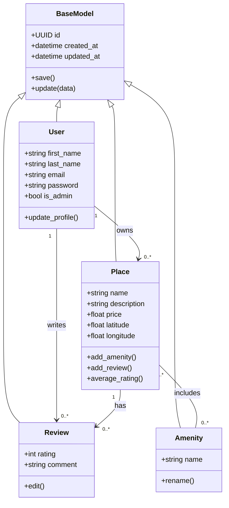

```mermaid
classDiagram
direction TB

class BaseModel {
  +UUID id
  +datetime created_at
  +datetime updated_at
  +save()
  +update(data)
}

class User {
  +string first_name
  +string last_name
  +string email
  +string password
  +bool is_admin
  +update_profile()
}

class Place {
  +string name
  +string description
  +float price
  +float latitude
  +float longitude
  +add_amenity()
  +add_review()
  +average_rating()
}

class Review {
  +int rating
  +string comment
  +edit()
}

class Amenity {
  +string name
  +rename()
}

BaseModel <|-- User
BaseModel <|-- Place
BaseModel <|-- Review
BaseModel <|-- Amenity

User "1" --> "0..*" Place : owns
User "1" --> "0..*" Review : writes
Place "1" --> "0..*" Review : has
Place "0..*" -- "0..*" Amenity : includes
```
