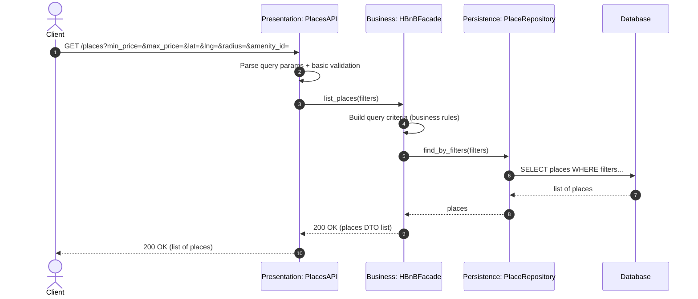

```mermaid
sequenceDiagram
autonumber
actor Client
participant API as Presentation: PlacesAPI
participant Facade as Business: HBnBFacade
participant PRepo as Persistence: PlaceRepository
participant DB as Database

Client->>API: GET /places?min_price=&max_price=&lat=&lng=&radius=&amenity_id=
API->>API: Parse query params + basic validation
API->>Facade: list_places(filters)

Facade->>Facade: Build query criteria (business rules)
Facade->>PRepo: find_by_filters(filters)
PRepo->>DB: SELECT places WHERE filters...
DB-->>PRepo: list of places
PRepo-->>Facade: places

Facade-->>API: 200 OK (places DTO list)
API-->>Client: 200 OK (list of places)
```
