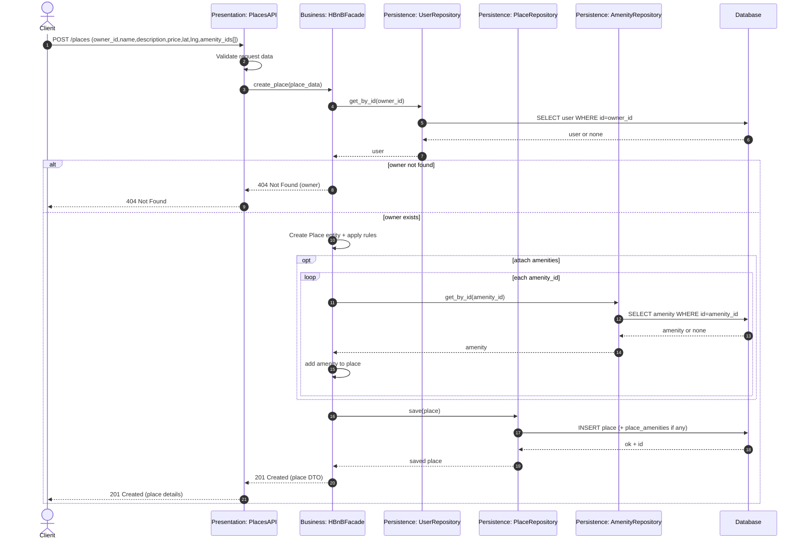

```mermaid
sequenceDiagram
autonumber
actor Client
participant API as Presentation: PlacesAPI
participant Facade as Business: HBnBFacade
participant URepo as Persistence: UserRepository
participant PRepo as Persistence: PlaceRepository
participant ARepo as Persistence: AmenityRepository
participant DB as Database

Client->>API: POST /places (owner_id,name,description,price,lat,lng,amenity_ids[])
API->>API: Validate request data
API->>Facade: create_place(place_data)

Facade->>URepo: get_by_id(owner_id)
URepo->>DB: SELECT user WHERE id=owner_id
DB-->>URepo: user or none
URepo-->>Facade: user

alt owner not found
  Facade-->>API: 404 Not Found (owner)
  API-->>Client: 404 Not Found
else owner exists
  Facade->>Facade: Create Place entity + apply rules

  opt attach amenities
    loop each amenity_id
      Facade->>ARepo: get_by_id(amenity_id)
      ARepo->>DB: SELECT amenity WHERE id=amenity_id
      DB-->>ARepo: amenity or none
      ARepo-->>Facade: amenity
      Facade->>Facade: add amenity to place
    end
  end

  Facade->>PRepo: save(place)
  PRepo->>DB: INSERT place (+ place_amenities if any)
  DB-->>PRepo: ok + id
  PRepo-->>Facade: saved place

  Facade-->>API: 201 Created (place DTO)
  API-->>Client: 201 Created (place details)
end
```
