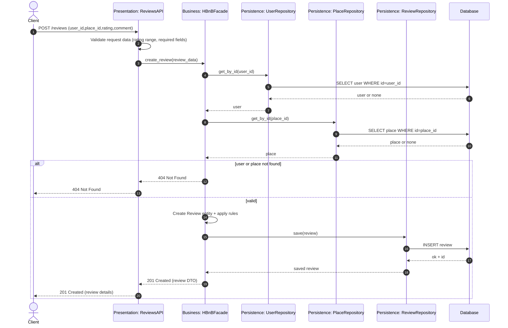

```mermaid
sequenceDiagram
autonumber
actor Client
participant API as Presentation: ReviewsAPI
participant Facade as Business: HBnBFacade
participant URepo as Persistence: UserRepository
participant PRepo as Persistence: PlaceRepository
participant RRepo as Persistence: ReviewRepository
participant DB as Database

Client->>API: POST /reviews (user_id,place_id,rating,comment)
API->>API: Validate request data (rating range, required fields)
API->>Facade: create_review(review_data)

Facade->>URepo: get_by_id(user_id)
URepo->>DB: SELECT user WHERE id=user_id
DB-->>URepo: user or none
URepo-->>Facade: user

Facade->>PRepo: get_by_id(place_id)
PRepo->>DB: SELECT place WHERE id=place_id
DB-->>PRepo: place or none
PRepo-->>Facade: place

alt user or place not found
  Facade-->>API: 404 Not Found
  API-->>Client: 404 Not Found
else valid
  Facade->>Facade: Create Review entity + apply rules
  Facade->>RRepo: save(review)
  RRepo->>DB: INSERT review
  DB-->>RRepo: ok + id
  RRepo-->>Facade: saved review

  Facade-->>API: 201 Created (review DTO)
  API-->>Client: 201 Created (review details)
end
```
