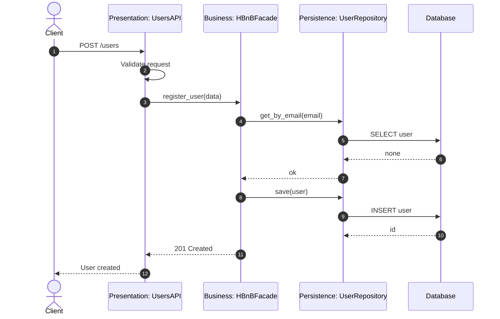

```mermaid
sequenceDiagram
autonumber
actor Client
participant API as Presentation: UsersAPI
participant Facade as Business: HBnBFacade
participant Repo as Persistence: UserRepository
participant DB as Database

Client->>API: POST /users
API->>API: Validate request
API->>Facade: register_user(data)
Facade->>Repo: get_by_email(email)
Repo->>DB: SELECT user
DB-->>Repo: none
Repo-->>Facade: ok
Facade->>Repo: save(user)
Repo->>DB: INSERT user
DB-->>Repo: id
Facade-->>API: 201 Created
API-->>Client: User created
```
