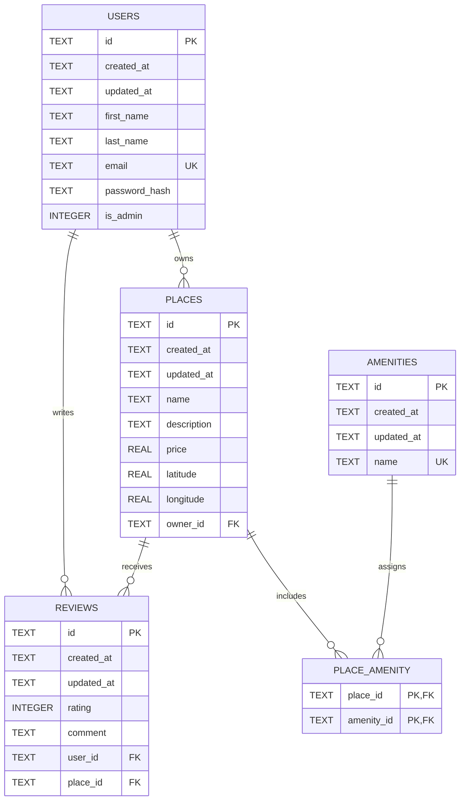

# HBnB Part 3 ER Diagram

This Mermaid ER diagram reflects the SQL schema defined in `part3/sql/schema.sql`.

## Relationship Summary

- One user can own many places.
- One user can write many reviews.
- One place can have many reviews.
- Places and amenities are linked through the `place_amenity` join table.
- `reviews(user_id, place_id)` is unique, preventing duplicate reviews from the same user for the same place.
